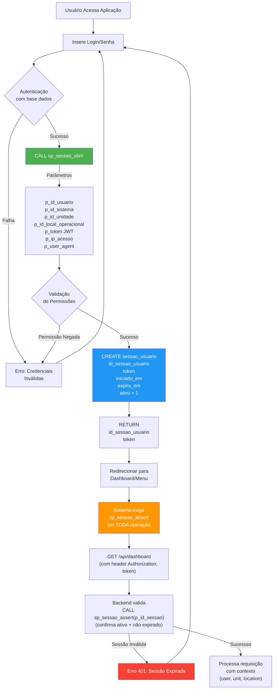
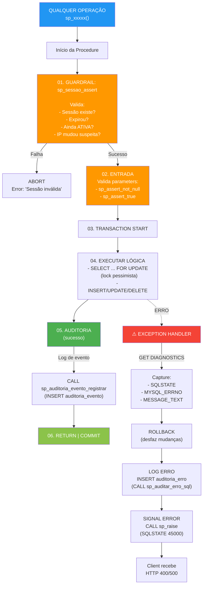
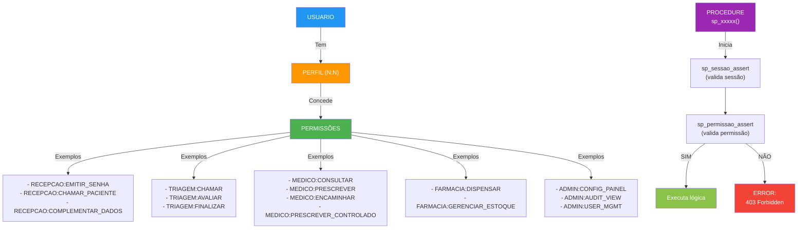
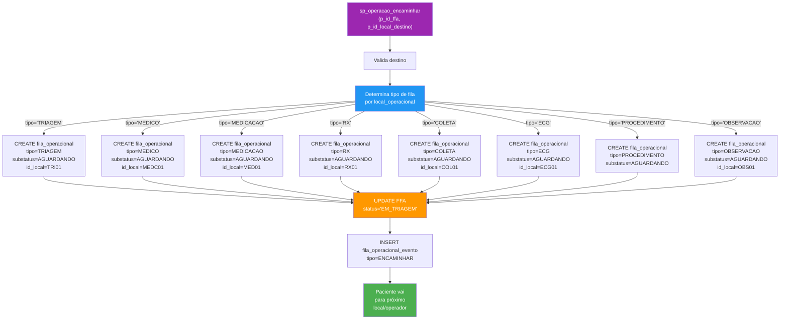

# FLUXOS & ARQUITETURA VISUAL - SISTEMA PRONTO ATENDIMENTO

---

## 🔐 FLUXO 1: AUTENTICAÇÃO & SESSÃO



---

## 🎫 FLUXO 2: EMISSÃO DE SENHA → ATENDIMENTO COMPLETO

```mermaid
graph TD
    A["📍 RECEPÇÃO<br/>(Chegada Paciente)"] -->|Totem ou Atendente| B["<b>EMISSÃO DE SENHA</b>"]
    
    B -->|CALL sp_senha_emitir| B1["INPUT:<br/>tipo='CLINICO'/'PEDI'/'PRI'/'EMG'<br/>origem='TOTEM'/'REC'<br/>id_unidade<br/>id_local<br/>"]
    B1 --> B2["CREATE senhas<br/><br/>status = GERADA<br/>tipo_atendimento<br/>origem<br/>lane<br/>criada_em<br/><br/>OUTPUT:<br/>id_senha (ex: 142)<br/>codigo (ex: A001)"]
    B2 --> B3["INSERT fila_senha<br/>(sync com painel público)"]
    B3 --> B4["INSERT senha_eventos<br/>(EMITIR)"]
    B4 --> C["📊 PAINEL PÚBLICO<br/>(TV + Totem)<br/><br/>Status: GERADA<br/>Mensagem: 'Sua senha: A001'"]
    
    C --> D["⏳ AGUARDANDO<br/>(Paciente na fila)"]
    D -->|Usuário recepção<br/>chama próxima| E["<b>CHAMADA PARA<br/>COMPLEMENTAÇÃO</b>"]
    
    E -->|CALL sp_senha_chamar_proxima| E1["INPUT:<br/>id_local_operacional<br/>id_lane<br/><br/>SELECT<br/>FROM fila_senha<br/>WHERE status='AGUARDANDO'<br/>AND lane = ..."]
    E1 --> E2["FOR UPDATE (lock)<br/>Pega registro<br/>mais antigo com<br/>maior prioridade"]
    E2 --> E3["UPDATE senhas<br/>status = CHAMANDO<br/>chamada_em = NOW()<br/><br/>UPDATE fila_senha<br/>status = CHAMANDO"]
    E3 --> E4["INSERT senha_eventos<br/>(CHAMAR)"]
    E4 --> C_A["📢 PAINEL GRITA<br/>'A001 - RECEPÇÃO'<br/>(opcional TTS)"]
    
    C_A --> F["👤 Paciente vai<br/>para atendente"]
    F --> F1["<b>COMPLEMENTAÇÃO<br/>DE DADOS</b>"]
    
    F1 -->|Operador coleta| F2["Nome completo<br/>CPF + CNS<br/>RG<br/>Data nascimento<br/>Sexo + Mãe<br/>Email + Telefone<br/>Endereço completo<br/>(17 campos)"]
    
    F2 -->|CALL sp_recepcao_complementar_e_abrir_ffa| F3["CORE PROCEDURE<br/><br/>1. MERGE PESSOA<br/>   SELECT pessoa<br/>   WHERE cpf=p_cpf<br/>   OR cns=p_cns"]
    F3 --> F4["2. CREATE/UPDATE PACIENTE<br/>   (sempre 1:1 com pessoa)<br/>   prontuario='PR'+id_pessoa<br/>   cns_vigente=p_cns"]
    F4 --> F5["3. CREATE ATENDIMENTO<br/>   id_unit,<br/>   id_patient,<br/>   id_senha,<br/>   protocolo (será GPAT)"]
    F5 --> F6["4. CREATE FFA<br/>   (Ficha Fila Atendimento)<br/>   id_atendimento (1:1)<br/>   classif_risco=VERDE<br/>   status=ABERTO"]
    F6 --> F7["5. GENERATE GPAT<br/>   Padrão:<br/>   'GPAT-'<br/>   + DATE_FORMAT NOW %Y%m%d<br/>   + LPAD id_senha 10 dígitos<br/><br/>   Ex: GPAT-20260220-0000000142"]
    F7 --> F8["6. UPDATE SENHAS<br/>   status = ENCAMINHADO<br/>   id_paciente = p_id<br/>   id_ffa = f_id<br/>   fim_complementacao_em=NOW()"]
    F8 --> F9["7. INSERT evento_senha<br/>   tipo='COMPLEMENTACAO_SUCESSO'<br/><br/>8. CALL sp_auditoria_evento<br/>   (log de negócio)"]
    F9 --> F10["OUTPUT:<br/>id_pessoa<br/>id_paciente<br/>id_atendimento<br/>id_ffa<br/>gpat_code"]
    
    F10 --> G["✅ FFA CRIADA E ABERTA"]
    
    G -->|Próx passo| H["<b>ENCAMINHAMENTO<br/>PARA TRIAGEM</b>"]
    H -->|CALL sp_recepcao_encaminhar_ffa| H1["INPUT:<br/>p_id_ffa<br/><br/>CREATE fila_operacional<br/>tipo='TRIAGEM'<br/>substatus='AGUARDANDO'<br/>id_ffa<br/>id_local='TRI01'"]
    H1 --> H2["INSERT fila_operacional_evento<br/>(ENCAMINHAR)"]
    H2 --> H3["UPDATE FFA<br/>status='EM_TRIAGEM'"]
    
    H3 --> I["🩺 TRIAGEM<br/>(Enfermeiro)"]
    
    style B fill:#2196F3,color:#fff
    style E fill:#4CAF50,color:#fff
    style F1 fill:#FF9800,color:#fff
    style F3 fill:#9C27B0,color:#fff
    style H fill:#E91E63,color:#fff
    style I fill:#00BCD4,color:#fff
    style G fill:#8BC34A,color:#fff
```



---

## 🩺 FLUXO 3: TRIAGEM → CONSULTA MÉDICA → ALTA/DESFECHO

```mermaid
graph TD
    A["🩺 TRIAGEM<br/>(Local: TRI01)"] -->|Enfermeiro chama| B["CALL sp_triagem_chamar"]
    B -->|Lógica| B1["SELECT fila_operacional<br/>WHERE tipo='TRIAGEM'<br/>AND status='AGUARDANDO'<br/>FOR UPDATE<br/><br/>ORDER BY prioridade DESC,<br/>      entrada_original_em ASC"]
    B1 --> B2["UPDATE fila<br/>status='EM_EXECUCAO'<br/>data_inicio=NOW()"]
    B2 --> B3["Enfermeiro coleta:<br/>Sinais vitais (PA,FC,FR,T°,O2)<br/>Queixa principal<br/>Classificação de risco<br/>(VERMELHO/LARANJA/AMARELO/VERDE/AZUL)"]
    B3 --> B4["INSERT triagem<br/>INSERT atendimento_sinais_vitais"]
    B4 --> B5["CALL sp_triagem_finalizar<br/>(ou automático)"]
    B5 --> B6["UPDATE fila_operacional<br/>status='FINALIZADO'<br/>data_fim=NOW()"]
    B6 --> C["📋 FILA MÉDICA<br/>(painel operacional)"]
    
    C -->|Médico chama| D["CALL sp_medico_chamar"]
    D -->|Similar a triagem| D1["SELECT fila_operacional<br/>WHERE tipo='MEDICO'<br/>FOR UPDATE<br/>Seleciona por prioridade"]
    D1 --> D2["UPDATE status='CHAMANDO'"]
    D2 --> E["👨‍⚕️ CONSULTÓRIO<br/>(Local: MEDC01)"]
    
    E --> F["Médico realiza:<br/>1. Exame físico<br/>   (estado geral, nível consciência)<br/><br/>2. Diagnóstico<br/>   (CID-10)<br/><br/>3. Prescrição<br/>   - Medicamentos<br/>   - Exames (RX, Lab)<br/>   - Procedimentos"]
    F --> F1["INSERT atendimento_evolucao (notas)<br/>INSERT atendimento_exame_fisico<br/>INSERT atendimento_diagnosticos<br/>INSERT atendimento_prescricao<br/>INSERT atendimento_pedidos_exame"]
    F1 --> F2["Médico decide<br/>próximo setor"]
    
    F2 -->|Medicação urgente| G1["↓ MEDICACAO<br/>(Local: MED01)"]
    F2 -->|Exame imagem| G2["↓ RX<br/>(Local: RX01)"]
    F2 -->|Coleta sangue| G3["↓ COLETA/LAB<br/>(Local: COL01)"]
    F2 -->|Observação| G4["↓ OBSERVACAO<br/>(Local: OBS01)"]
    F2 -->|Alta direto| G5["↓ ALTA<br/>(Local: N/A)"]
    
    G1 -->|CALL sp_medico_encaminhar| E1["INPUT:<br/>p_id_ffa<br/>p_id_local_destino<br/><br/>CREATE fila_operacional<br/>tipo='MEDICACAO'<br/>id_local='MED01'<br/>status='AGUARDANDO'"]
    E1 --> E2["UPDATE FFA<br/>status='AGUARDANDO_MEDICACAO'<br/><br/>Farmácia + Enfermeiro:<br/>- Prepara medicação<br/>- Administra (dupla conferência)<br/>- Marca executado"]
    E2 --> E3["CALL sp_medicacao_marcar_executado<br/>status='FINALIZADO'"]
    
    G5 -->|CALL sp_medico_finalizar| H["📝 DESFECHO"]
    H -->|Médico registra| H1["INSERT atendimento_desfecho<br/>tipo_desfecho=<br/>  'ALTA_MEDICA' ou<br/>  'ALTA_A_PEDIDO' ou<br/>  'TRANSFERENCIA' ou<br/>  'OBITO' ou<br/>  'EVASAO'"]
    H1 --> H2["Se ALTA:<br/><br/>INSERT atendimento_sumario_alta<br/>(resumo clínico)<br/><br/>INSERT documento_emissao<br/>(receita, atestado)"]
    H2 --> H3["UPDATE FFA<br/>status='FINALIZADO'<br/>data_alta=NOW()"]
    H3 --> I["✅ ALTA REALIZADA<br/><br/>Paciente sai com<br/>receitas + documentos"]
    
    style A fill:#00BCD4,color:#fff
    style E fill:#FF9800,color:#fff
    style H fill:#4CAF50,color:#fff
    style I fill:#8BC34A,color:#fff
    style G1 fill:#E91E63,color:#fff
    style G2 fill:#9C27B0,color:#fff
    style G3 fill:#3F51B5,color:#fff
```



---

## 💊 FLUXO 4: FARMÁCIA & DISPENSAÇÃO

```mermaid
graph TD
    A["📋 PRESCRIÇÃO<br/>(do Médico)"] --> B["INSERT atendimento_prescricao<br/>id_medicamento<br/>dose<br/>via (oral, IV, IM)<br/>frequência<br/>duração"]
    B --> C["FFA encaminhado<br/>para MEDICACAO"]
    
    C -->|Setor Farmácia| D["👨‍⚕️ FARMACÊUTICO<br/>Recebe prescrição"]
    D -->|FASE 1: PREPARAÇÃO| D1["1. Confere prescrição<br/><br/>2. Seleciona medicamento<br/>   id_farmaco<br/>   dose correta<br/><br/>3. Valida lote<br/>   farmaco_lote<br/>   validade >= hoje<br/>   quantidade >= solicitado"]
    D1 --> D2["4. Marca saída<br/>   INSERT dispensacao_medicacao<br/>   id_atendimento<br/>   id_farmaco<br/>   id_lote<br/>   quantidade<br/>   status='DISPENSADO'"]
    D2 --> D3["5. BAIXA ESTOQUE<br/>   UPDATE estoque_almoxarifado_central<br/>   quantidade -= dispensado<br/><br/>   INSERT estoque_movimento<br/>   tipo='SAIDA'<br/>   (auditoria)"]
    D3 --> E["📦 Medicação<br/>embalada"]
    
    E -->|Vai para| F["👩‍⚕️ SETOR MEDICAÇÃO<br/>(Enfermagem)"]
    F -->|FASE 2: ADMINISTRAÇÃO| F1["1. Dupla conferência<br/>   Enfermeiro A + Enfermeiro B<br/>   Verificam:<br/>   - Medicamento correto<br/>   - Dose correta<br/>   - Via correta<br/>   - Paciente correto"]
    F1 --> F2["2. Administra<br/>   Se IV: prepara infusão<br/>   Se IM: aplica injeção<br/>   Se VO: oferece comprimido"]
    F2 --> F3["3. Registra<br/>   INSERT administracao_medicacao<br/>   id_atendimento<br/>   id_prescricao<br/>   dose_administrada<br/>   via<br/>   data_hora_administracao<br/>   id_usuario (enfermeiro)<br/>   id_usuario_verificador<br/>"]
    F3 --> F4["4. Marca no sistema<br/>   CALL sp_medicacao_marcar_executado<br/>"]
    F4 --> G["✅ MEDICAÇÃO<br/>ADMINISTRADA"]
    
    G --> H["⚠️ CASO ESPECIAL:<br/>GPAT (Prescrição Externa)"]
    H -->|Para receita do paciente| H1["INSERT gpat_atendimento<br/>tipo_prescritor='INTERNO'/'EXTERNO'<br/>data_emissao<br/>data_validade<br/>status='ABERTO'"]
    H1 --> H2["INSERT gpat_item<br/>(medicamentos da gpat)"]
    H2 --> H3["Paciente leva prescrição<br/>para farmácia externa"]
    H3 --> H4["Farmácia externa<br/>dispensa"]
    H4 --> H5["INSERT gpat_dispensacao<br/>quando paciente pega"]
    
    style A fill:#FFC107,color:#000
    style D1 fill:#E91E63,color:#fff
    style F1 fill:#4CAF50,color:#fff
    style G fill:#8BC34A,color:#fff
    style H fill:#FF5722,color:#fff
```



---

## 📦 FLUXO 5: ESTOQUE & ALMOXARIFADO

```mermaid
graph TD
    A["📥 RECEBIMENTO<br/>(Almoxarifado)"] -->|Fornecedor entrega| A1["Recebe Nota Fiscal<br/>Verifica:<br/>- Quantidade<br/>- Lotes<br/>- Datas validade<br/>- Especificações"]
    
    A1 --> A2["INSERT estoque_almoxarifado_central<br/>id_produto<br/>lote<br/>validade<br/>quantidade<br/>nf_entrada<br/>fornecedor_id<br/>status='ATIVO'"]
    
    A2 --> A3["INSERT estoque_movimento<br/>tipo='ENTRADA'<br/>quantidade<br/>motivo"]
    
    A3 --> B["🏪 ESTOQUE CENTRAL"]
    B -->|Monitory| B1["CHECK: estoque_alerta<br/>SE quantidade >= max_estoque<br/>  → Alertar excesso<br/>SE quantidade <= min_estoque<br/>  → Alertar reposição"]
    
    B1 --> C["📤 REQUISIÇÃO<br/>(Setores)"]
    C -->|Setor pede| C1["Requer produtos<br/>(medicamentos, material)<br/>para atendimento"]
    
    C1 --> C2["INSERT estoque_movimento<br/>tipo='SAIDA'<br/>origem ENUM:<br/>  FARMACIA<br/>  ALMOXARIFADO<br/>  MANUTENCAO<br/>quantidade"]
    
    C2 --> C3["UPDATE estoque_almoxarifado<br/>(local do setor)<br/>quantidade_atual -= retirado"]
    
    C3 --> D["🔄 CONSUMO REAL"]
    D -->|Uso em atendimento| D1["INSERT consumo_insumo<br/>id_produto<br/>origem<br/>quantidade<br/>motivo='ROTINA'/'DOACAO'/<br/>        'COMPRA'/'REPOSICAO'"]
    
    D1 --> E["📊 MONITORAMENTO"]
    E -->|Sistema avalia| E1["1. Saldo por local<br/>   SELECT SUM quantidade<br/>   FROM estoque_movimento<br/>   WHERE tipo IN ('ENTRADA','SAIDA')"]
    
    E1 --> E2["2. Validades<br/>   SELECT *<br/>   FROM farmaco_lote<br/>   WHERE validade <= DATE_ADD(NOW(),<br/>                INTERVAL 30 DAY)<br/>   status='ATIVO'"]
    
    E2 --> E3["3. Alertas<br/>   INSERT alerta<br/>   tipo=BAIXO_ESTOQUE|CRITICO|VENCIMENTO"]
    
    E3 --> F["📋 INVENTÁRIO PERIÓDICO"]
    F -->|A cada período| F1["Contagem física dos produtos"]
    
    F1 --> F2["INSERT estoque_inventario<br/>data_inventario<br/>quantidade_esperada (BD)<br/>quantidade_realizada (contagem)<br/>diferenca = realizada - esperada"]
    
    F2 --> F3["Se diferença:<br/>INSERT estoque_movimento (ajuste)<br/>tipo='AJUSTE'<br/>motivo='Acurácia de inventário'"]
    
    style A fill:#2196F3,color:#fff
    style B fill:#4CAF50,color:#fff
    style C fill:#FF9800,color:#fff
    style E fill:#9C27B0,color:#fff
    style F fill:#F44336,color:#fff
```



---

## 🏥 FLUXO 6: INTERNAÇÃO HOSPITALAR

```mermaid
graph TD
    A["👤 Paciente" & "FFA"] -->|Médico solicita| B["INTERNACAO AO HOSPITAL"]
    
    B --> C["Selecionar Leito<br/>leito.status='DISPONIVEL'"]
    C --> D["INSERT internacao<br/>id_ffa<br/>id_leito<br/>tipo=<br/>  OBSERVACAO (< 24h) ou<br/>  INTERNACAO (≥ 24h)<br/>status='ATIVA'<br/>precaucao (CONTATO/GOTICULAS/AEROSSOIS)"]
    
    D --> E["📋 PRESCRIÇÃO INICIAL<br/>(Médico internista)"]
    E -->|Dia 1| E1["INSERT internacao_prescricao<br/>data_prescricao<br/>status='ATIVA'"]
    
    E1 --> E2["INSERT internacao_prescricao_item<br/>(múltiplos itens)<br/>tipo=<br/>  MEDICAMENTO<br/>  DIETA<br/>  CUIDADO<br/>frequencia"]
    
    E2 --> F["🍽️ DIETA"]
    F -->|Nutricionista| F1["INSERT internacao_dietas<br/>tipo=LIVRE|BRANDAS|PASTOSA|LIQUIDA|ENTERAL|PARENTERAL<br/>observacao"]
    
    E2 --> G["💉 MEDICAÇÃO"]
    G -->|Enfermagem q6h| G1["INSERT internacao_medicacao_administracao<br/>horario_prescrito<br/>horario_executado<br/>status=ADMINISTRADO|RECUSADO|SUSPENSO<br/>id_usuario_executador"]
    
    E2 --> H["📊 DISPOSITIVOS"]
    H -->|Se necessário| H1["INSERT internacao_dispositivos<br/>tipo=CVC|SVD|SNG|SNE|DRENO<br/>data_insercao<br/>intervalo_troca"]
    
    E2 --> I["👥 CUIDADOS ESPECIAIS"]
    I -->|Ordem de enfermagem| I1["INSERT internacao_cuidados<br/>tipo=<br/>  FERIDA<br/>  DRENAGEM<br/>  SONDA<br/>  OXIGENIO<br/>  SINAIS_VITAIS<br/>  MOVILIZACAO<br/>frequencia"]
    
    I1 --> J["📝 AVALIAÇÃO CONTÍNUA"]
    J -->|A cada turno (6/6h)| J1["INSERT internacao_registro_enfermagem<br/>turno=MANHA|TARDE|NOITE<br/>observacoes<br/>sinais_vitais JSON"]
    
    J1 --> J2["Si risco LPP:<br/>INSERT internacao_braden_avaliacao<br/>score_total<br/>risco category"]
    
    J2 --> K["🩹 FERIDA (se aplica)"]
    K -->|Avaliação diária| K1["INSERT internacao_ferida_avaliacao<br/>tipo=FERIDA|LPP|CIRURGICA<br/>estagio_lpp<br/>dimensiones<br/>drenagem<br/>appearance"]
    
    K1 --> L["⏰ DURAÇÃO"]
    L -->|Paciente melhora| L1["Médico registra<br/>data_prevista_alta"]
    
    L1 --> M["🚪 ALTA HOSPITALAR"]
    M --> M1["INSERT atendimento_sumario_alta<br/>motivo_internacao<br/>resumo_clinico<br/>procedimentos_realizados<br/>medicamentos_receitados<br/>orientacoes_pos_alta"]
    
    M1 --> M2["UPDATE internacao<br/>status='ENCERRADA'<br/>data_saida=NOW()"]
    
    M2 --> M3["UPDATE leito<br/>status='DISPONIVEL'<br/>(volta a disponível)"]
    
    M3 --> N["DELETE internacao_dispositivos<br/>(registra removals)"]
    
    N --> O["✅ PACIENTE RECEBE ALTA"]
    
    style A fill:#FF9800,color:#fff
    style B fill:#E91E63,color:#fff
    style E fill:#2196F3,color:#fff
    style M fill:#4CAF50,color:#fff
    style O fill:#8BC34A,color:#fff
```

---

## 📊 ESTRUTURA DE SEGURANÇA & AUDITORIA



---

## 🎯 MAPA DE PERMISSÕES (RBAC)



---

## 📱 ARQUITETURA DE CAMADAS

```
┌─────────────────────────────────────────────────────────┐
│                    FRONTEND LAYER                       │
│  React/Vue/Angular - Web + Mobile (Capacitor/React-Native)
│                                                         │
│  - Recepção (Tela emissão senha, chamada)              │
│  - Triagem (Vital signs, classificação risco)          │
│  - Médico (Consulta, prescrição, encaminhamento)       │
│  - Farmácia (Dispensação)                              │
│  - Admin (Config, relatórios, CRUD)                    │
│  - Painel Público (TV, Totem)                          │
└──────────────────┬──────────────────────────────────────┘
                   │ HTTP/REST
┌──────────────────┴──────────────────────────────────────┐
│                     API LAYER                           │
│  Express/Node.js / Spring Boot / FastAPI                │
│                                                         │
│  - GET/POST /api/sessao (login, logout, contexto)      │
│  - GET/POST /api/senhas (emitir, chamar)               │
│  - GET/POST /api/ffa (complementar, encaminhar)        │
│  - GET/POST /api/triagem (dados, finalizar)            │
│  - GET/POST /api/medico (consulta, prescrição)         │
│  - GET/POST /api/farmacia (dispensação)                │
│  - GET/POST /api/painel (config, filters)              │
│  - POST /api/audit (logs)                              │
│                                                         │
│  Middleware:                                            │
│  - JWT authentication (token validation)                │
│  - RBAC authorization (sp_permissao_assert)            │
│  - Error mapping (SQL errors → HTTP)                    │
│  - Logging (request/response)                           │
└──────────────────┬──────────────────────────────────────┘
                   │ Prepared Statements with IN/OUT params
┌──────────────────┴──────────────────────────────────────┐
│                 DATABASE LAYER                          │
│  MySQL 8.0.44 - Stored Procedures                       │
│                                                         │
│  All business logic encapsulated in 80+ Procedures      │
│  - Session management (sp_sessao_*)                     │
│  - Queue operations (sp_senha_*, sp_triagem_*)          │
│  - Clinical (sp_medico_*, sp_medicacao_*)               │
│  - Configuration (sp_painel_*, sp_config_*)             │
│  - Audit (sp_auditoria_*, sp_auditar_*)                │
│                                                         │
│  Error Strategy:                                        │
│  ├─ sp_sessao_assert (mandatory gate)                  │
│  ├─ sp_permissao_assert (access control)               │
│  ├─ sp_assert_true/sp_assert_not_null (validation)    │
│  └─ sp_raise (custom exceptions → SQLSTATE 45000)      │
│                                                         │
│  Audit Trail:                                           │
│  ├─ auditoria_evento (business events)                 │
│  ├─ auditoria_erro (SQL errors)                        │
│  ├─ auditoria_acesso (data access - LGPD)              │
│  └─ senha_eventos (queue state changes)                │
└─────────────────────────────────────────────────────────┘
```

---

## 🔀 DECISÃO DE ENCAMINHAMENTO (sp_operacao_encaminhar)



---

## 📊 PAINEL: CONFIGURAÇÃO DINÂMICA

```mermaid
graph TD
    A["Admin abre<br/>config de painel"] --> B["CALL sp_painel_config_set<br/>(painel_id, chave, valor, tipo)"]
    
    B --> C["Tipos de config:<br/>BOOL, INT, DECIMAL<br/>TEXT, JSON, ENUM"]
    
    C --> D["Type validation:<br/>- valor_bool ← boolean<br/>- valor_int ← integer<br/>- valor_decimal ← decimal<br/>- valor_text ← string<br/>- valor_json ← JSON<br/>- valor_enum ← enum"]
    
    D --> E["INSERT painel_config<br/>id_painel (PK)<br/>chave (PK)<br/>valores...]
    
    E --> F["Exemplos de config:"]
    
    F -->|Config exemplo| F1["chave='INTERVALO_ATUALIZACAO'<br/>valor_int=5<br/>(atualiza a cada 5s)"]
    
    F -->|Config exemplo| F2["chave='EMITE_SOM'<br/>valor_bool=1<br/>(painel fala)"]
    
    F -->|Config exemplo| F3["chave='COR_TEMA'<br/>valor_enum='AZUL'<br/>(visual do painel)"]
    
    F -->|Config exemplo| F4["chave='FILTRO_LOCAIS_CODIGOS_JSON'<br/>valor_json='['REC01','REC02','REC03']'<br/>(quais locais mostrar)"]
    
    G["CALL sp_painel_filtro_locais_seed<br/>(painel_codigo, local_tipo, prefix)"] --> G1["Procura na tabela<br/>local_operacional todos<br/>com tipo=tipo_param"]
    
    G1 --> G2["GROUP_CONCAT(JSON_QUOTE(codigo))<br/>Monta JSON array de códigos<br/>Ex: ['REC01','REC02','REC03','REC04']"]
    
    G2 --> G3["CALL sp_painel_config_set<br/>com resultado JSON"]
    
    style A fill:#FF9800,color:#fff
    style B fill:#2196F3,color:#fff
    style E fill:#4CAF50,color:#fff
    style G fill:#9C27B0,color:#fff
```

---

## 📈 MÉTRICAS E KPI (Dashboard)

```plaintext
┌─────────────────────────────────────────────────────────────────┐
│ DASHBOARD - MÉTRICAS DO PRONTO ATENDIMENTO                      │
├─────────────────────────────────────────────────────────────────┤
│                                                                 │
│ 📊 HOJE (em tempo real):                                        │
│                                                                 │
│  Senhas Emitidas:      127                                     │
│  Senhas Atendidas:     109 (85%)                               │
│  Média Tempo Fila:     34 min                                  │
│  Não Comparecimentos:  8 (6%)                                  │
│  Taxa Alta Médica:     92%                                     │
│                                                                 │
│ 👥 FILAS OPERACIONAIS:                                          │
│                                                                 │
│  🟢 TRIAGEM:      [  5 aguardando, ETA 15min ]                │
│  🔵 MÉDICO:       [ 12 aguardando, ETA 45min ]                │
│  🟡 RX:           [  2 aguardando, ETA 5min  ]                │
│  🔴 MEDICACAO:    [  1 aguardando, ETA 2min  ]                │
│  🟣 COLETA/LAB:   [  3 aguardando, ETA 20min ]                │
│                                                                 │
│ 💊 FARMÁCIA:                                                    │
│                                                                 │
│  Medicamentos Dispensados (hoje):    145 itens                 │
│  Estoque Crítico (< min):             8 produtos               │
│  Medicamentos Vencendo (30 dias):    12 lotes                 │
│                                                                 │
│ 🏥 INTERNAÇÃO:                                                  │
│                                                                 │
│  Leitos Ocupados:      23 / 35 (66%)                           │
│  Em Observação:        8  / 15 (53%)                           │
│  Bloqueados/Manutenção: 2                                      │
│                                                                 │
│ 📋 AUDITORIA (últimas 24h):                                     │
│                                                                 │
│  Eventos registrados:     1,247                                │
│  Acessos a Prontuário:    342                                  │
│  Erros SQL:                 3                                  │
│  Alertas de Segurança:      0                                  │
│                                                                 │
└─────────────────────────────────────────────────────────────────┘

QUERIES SUGERIDAS (para Dashboard):

SELECT COUNT(*) from senhas 
  WHERE DATE(criada_em) = CURDATE()
  GROUP BY status;

SELECT tipo, COUNT(*) from fila_operacional
  WHERE substatus IN ('AGUARDANDO','EM_EXECUCAO')
  GROUP BY tipo;

SELECT COUNT(*) from dispensacao_medicacao
  WHERE DATE(criado_em) = CURDATE();

SELECT tipo_desfecho, COUNT(*) from atendimento_desfecho
  WHERE DATE(data_desfecho) = CURDATE()
  GROUP BY tipo_desfecho;
```

---

## 🔧 ENDPOINTS REST (RECOMENDADO)

```
┌──────────────────────────────────────────────────────────┐
│ SESSÃO & AUTENTICAÇÃO                                    │
├──────────────────────────────────────────────────────────┤
POST   /api/auth/login                   (sp_sessao_abrir)
POST   /api/auth/logout                  (sp_sessao_encerrar)
GET    /api/auth/contexto                (sp_sessao_contexto_get)
GET    /api/auth/validate                (sp_sessao_assert)

┌──────────────────────────────────────────────────────────┐
│ RECEPÇÃO (SENHAS)                                        │
├──────────────────────────────────────────────────────────┤
POST   /api/recepcao/senhas              (sp_senha_emitir)
GET    /api/recepcao/senhas              (listar aguardando)
POST   /api/recepcao/chamar              (sp_senha_chamar_proxima)
POST   /api/recepcao/complementar        (sp_recepcao_complementar_e_abrir_ffa)
POST   /api/recepcao/encaminhar          (sp_recepcao_encaminhar_ffa)
POST   /api/recepcao/nao-compareceu      (sp_recepcao_nao_compareceu)

┌──────────────────────────────────────────────────────────┐
│ TRIAGEM                                                  │
├──────────────────────────────────────────────────────────┤
POST   /api/triagem/chamar               (sp_triagem_chamar)
POST   /api/triagem/finalizar            (sp_triagem_finalizar)
PUT    /api/triagem/:id                  (atualizar dados triagem)

┌──────────────────────────────────────────────────────────┐
│ MÉDICO                                                   │
├──────────────────────────────────────────────────────────┤
POST   /api/medico/chamar                (sp_medico_chamar)
POST   /api/medico/encaminhar            (sp_medico_encaminhar)
POST   /api/medico/finalizar             (sp_medico_finalizar)
POST   /api/medico/marcar-retorno        (sp_medico_marcar_retorno)
GET    /api/ffa/:id                      (ver paciente)
PUT    /api/ffa/:id/evolucao             (registrar evolução)

┌──────────────────────────────────────────────────────────┐
│ FARMÁCIA                                                 │
├──────────────────────────────────────────────────────────┤
POST   /api/farmacia/dispensar           (dispensacao_medicacao)
POST   /api/medicacao/marcar-executado   (sp_medicacao_marcar_executado)
GET    /api/estoque/produtos             (listar medicamentos)
POST   /api/estoque/movimento            (registrar consumo)

┌──────────────────────────────────────────────────────────┐
│ CONFIGURAÇÃO                                             │
├──────────────────────────────────────────────────────────┤
GET    /api/painel/:codigo               (configuração painel)
POST   /api/painel/:codigo/config        (sp_painel_config_set)
POST   /api/painel/:codigo/seed-locais   (sp_painel_filtro_locais_seed)

┌──────────────────────────────────────────────────────────┐
│ DADOS MESTRE                                             │
├──────────────────────────────────────────────────────────┤
GET    /api/referencias/cid10            (CID-10)
GET    /api/referencias/sigtap           (procedimentos SUS)
GET    /api/referencias/cnes             (estabelecimentos)
GET    /api/referencias/classificacao    (risco Manchester)
```

---

## ✅ CHECKLIST DE IMPLEMENTAÇÃO

```
PRIORIDADE 1 (MVP - Primeira Semana):
☐ Base structure (usuarios, sessao_usuario, senhas)
☐ Auth endpoints (login, logout, validate)
☐ Emissão de senha UI (Recepção + Totem)
☐ Painel público (display filas)
☐ Complementação de dados (básico)

PRIORIDADE 2 (Segunda Semana):
☐ Triagem (coleta vital signs)
☐ Médico (consulta, prescrição)
☐ Encaminhamento (integ com sp_operacao_encaminhar)
☐ Painel operacional (visão do médico/enfermeiro)

PRIORIDADE 3 (Terceira Semana):
☐ Farmácia (dispensação, administração)
☐ Estoque (movimento, alertas)
☐ Relatórios (KPI, métricas)
☐ Auditoria (logs LGPD)

PRIORIDADE 4 (Quarta Semana+):
☐ Internação (leitos, prescrições)
☐ Laboratório (pedidos, resultados)
☐ RX/Imagem (protocolos, laudo)
☐ Faturamento (documentos, financeiro)
```

---

**Documento gerado:** 2026-02-20  
**Status:** PRONTO PARA DESENVOLVIMENTO FULL-STACK  
**Próximo passo:** Iniciar backend + frontend com prototipagem rápida
