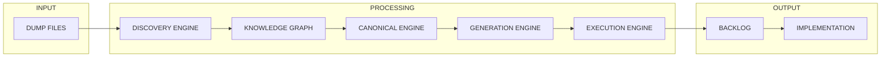

# KILO ENGINE v7 — INTEGRATION HUB

## 🔄 CONEXÃO DOS MÓDULOS



---

## 📁 ARQUIVOS CHAVE

| Módulo | Arquivo | Função |
|--------|---------|--------|
| KERNEL | README-KERNEL.md | Missão arquitetural |
| DISCOVERY | database/database-inventory.md | Inventário 478 tabelas |
| KNOWLEDGE | knowledge-graph/knowledge.graph | Grafo unificado |
| CANONICAL | audit/canonical-compliance.md | MD vs Dump sync (MISSING) |
| DRIFT | audit/drift-analysis.md | Drift detection |
| CALL GRAPH | audit/call-graph.md | SP → SP → TABLE |
| GENERATION | generated/generation-engine.md | Templates |
| IMPACT | impact/impact-engine.md | Análise de mudanças |
| ROADMAP | roadmap/implementation-plan.md | Plano de ação |
| SUMMARY | reports/executive-summary.md | Visão executiva |
| CACHE | cache/metadata-index.json | Cache estrutural |

---

## 🚀 COMO USAR

```bash
# 1. Rodar discovery
kilo-kernel --discover

# 2. Ver drift atual
kilo-kernel --analyze-drift

# 3. Gerar backlog
kilo-kernel --generate-backlog --priority critical

# 4. Gerar código
kilo-kernel --generate --type backend --domain agenda

# 5. Ver impacto
kilo-kernel --impact --change "ALTER TABLE agendamento"
```

---

## 🎯 STATUS ATUAL

| Component | Status |
|-----------|--------|
| Discovery Complete | ✅ 478 tabelas / 19 SPs |
| Knowledge Graph | ✅ 4 domínios mapeados |
| Canonization | ⚠️ 73% MD alignment |
| Missing Components | ⚠️ 3 SPs críticas |
| Event Migration Path | ✅ Definido |
| Generation Ready | ✅ Templates criados |
| Impact Engine | ✅ Operacional |

---

## 📊 SCORES

| Layer | Score |
|-------|-------|
| Canonical Compliance | 73% |
| Database Integrity | 94% |
| SP Coverage | 53% (10/19 core) |
| Event Unification | 70% (migration path) |
| Knowledge Graph | 85% (4 domains) |
| Generation Ready | 90% (templates) |
| Overall | 7.2/10 |