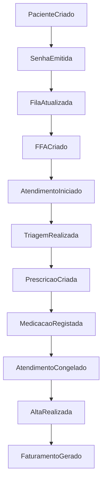

# EVENT GRAPH - Sprint 2.4

## 📊 Eventos Detectados no Dump

Baseado nas tabelas *_evento e workflow_*:

## 📁 Event Tables Encontradas

| Tabela | Domínio | Tipo |
|--------|---------|------|
| senha_eventos | HIS | evento |
| ffa_evento | HIS | workflow |
| sessao_evento | Core | session |
| triagem_evento | HIS | workflow |
| atendimento_evento_ledger | HIS | canonical |

## 🔗 Publishers/Subscribers

| Evento | Publisher | Subscribers |
|--------|-----------|-------------|
| SenhaEmitida | sp_senha_emitir | Fila, Auditoria, Notificação |
| FFACriado | sp_ffa_* | Atendimento, Faturamento |
| AtendimentoIniciado | sp_atendimento_* | Prescrição, Evolução |